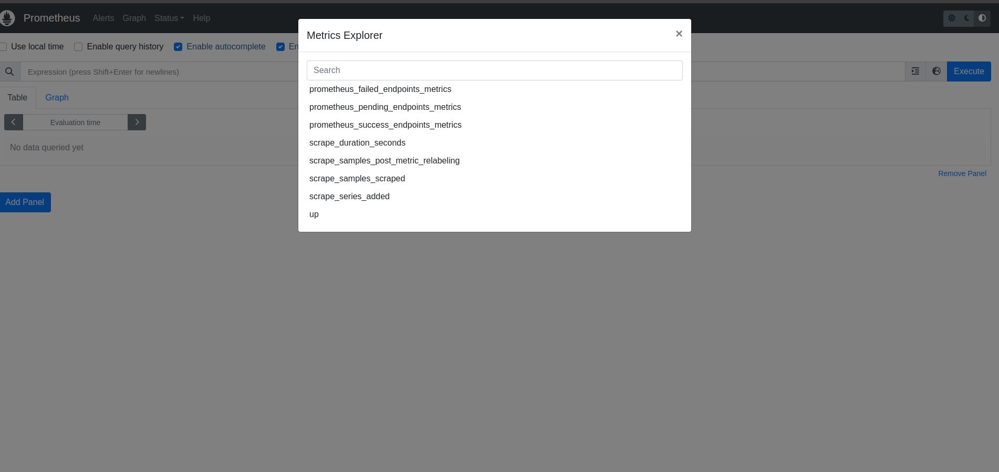

# Scraping RAW Labs Endpoint Metrics with Prometheus

## Set up a RAW Labs account

According to RAW Labs documentation:
RAW is a platform to enable fast and easy access, integration, delivery and sharing of data services as APIs. This includes:

1. Query multiple data sources in real-time including files, data lakes, databases and APIs;
2. Integrate and transform data in real-time;
3. Deliver and manage the data product output as APIs;
4. Share access to the APIs with any number of users or applications.

In order to get started, the only prerequisite is to create your own account. Just go to https://app.raw-labs.com and Register Now! for a new account.

More info regarding RAW platform can be found in the official website.

## Expose custom event and metrics in the form of a RAW endpoint

Data integration is accomplished via a low-code data-oriented scripting language called Snapi that is easy to get started and powerful enough for the most complex data integration scenarios. Data sharing is executed in the form of APIs. These APIs can be created in various ways; the simplest way is via the Producer User Interface, which will be demonstrated here.

### Create endpoint
Go to the Catalog and click Add new to create a new endpoint.
First, fill in the Publish path, under the auto-generated URL. Optionally specify a title and a description. Finally write you Snapi to generate the custom event data.


In our use case, we want to create 3 Prometheus metrics:
prometheus_failed_endpoints_metrics, 
prometheus_success_endpoints_metrics
prometheus_pending_endpoints_metrics

Each of these metrics return the total number of the success, pending or failed endpoint executions. For the shake of simplicity, we retrieve the required data from another HTTP Endpoint. However, we can have a arbitrarily complex combination of data sources, such as combining data from a PostgreSQL with data from JSON files located in AWS s3 bucket.
More info to combine multiple data sources can be found here.
Here is a sample response of the aforementioned HTTP Endpoint.

```bash
[
    {
      "count" 123,
      "state": success,
    },
    {
      "count" 456,
      "state": pending,
    },
    {
      "count" 789,
      "state": failed,
    },
]
```
Here is the code, that retrieves data from a HTTP Endpoint and transforms them into the Prometheus metrics format.
```bash
prometheus_metric_format(metric_name: string) = 
    let 
        metric = "prometheus_"+ metric_name,
        metric_help = """
# HELP this is a help message for random_metric_A
""",
        metric_type = "# TYPE " + metric + " " + "gauge" + "\n",
        template = metric_help + metric_type + metric + " "
    in 
        template

prometheus_endpoint_state() = 
  let
    endpoints_status = Json.Read(
        Http.Get(
            "http://my.private.endpoint",
            headers = [{"x-raw-api-key","my_api_key"}]
        ),
        type collection(record(state: string, count: int))
    ),
    failed_endpoints_metrics = prometheus_metric_format("failed_endpoints_metrics") + String.From(Collection.First(Collection.Filter(endpoints_status, status -> status.state == "failed").count)),
    success_endpoints_metrics = prometheus_metric_format("success_endpoints_metrics") + String.From(Collection.First(Collection.Filter(endpoints_status, status -> status.state == "success").count)),
    pending_endpoints_metrics = prometheus_metric_format("pending_endpoints_metrics") + String.From(Collection.First(Collection.Filter(endpoints_status, status -> status.state == "pending").count)),
    metrics = failed_endpoints_metrics + "\n" + success_endpoints_metrics + "\n" + pending_endpoints_metrics
  in
    metrics

prometheus_endpoint_state()
```
Here is return output of the endpoint:

And here is an expected output
```bash
    # HELP this is a help message for random_metric_A
    # TYPE prometheus_failed_endpoints_metrics gauge
    prometheus_failed_endpoints_metrics 2377
    
    # HELP this is a help message for random_metric_A
    # TYPE prometheus_success_endpoints_metrics gauge
    prometheus_success_endpoints_metrics 111361
    
    # HELP this is a help message for random_metric_A
    # TYPE prometheus_pending_endpoints_metrics gauge
    prometheus_pending_endpoints_metrics 20
```


### Configure Endpoint

Now that we created our endpoint,
    
1. Configure the return format of the endpoint as **text**. Prometheus accepts *text/plain* Content-Type ( [link here](https://prometheus.io/docs/instrumenting/exposition_formats/) ).
2. Select **Private** visibility in order not to expose the endpoint publicly. 
3. Add Scopes for the endpoint. This is important later on when we will create the API Key.    

4. Publish the Endpoint

### Generating an API Key

Now that the endpoint is created we need an API Key in order to access our private endpoint

Go to **API Keys** , press **Add API Key** and make sure you add at least one of the scopes you used on the endpoint.


Now we our metrics endpoint is all set.


## Deploy Proxy

In order to expose the metrics generated from the RAW endpoint to Prometheus, an Nginx proxy must be deployed. This is necessary if your endpoint is private, because Prometheus does not support scraping metrics using custom headers, which is a required for the private RAW endpoint. The proxy will be responsible for adding the custom header x-raw-api-key to the request made to the RAW endpoint.
To deploy the Nginx proxy, follow example below:

Create an nginx configuration file *nginx.conf.template* to add the header for the RAW Api key

```bash
server {
  listen ${NGINX_HOST}:${NGINX_PORT};
  location / {
    proxy_set_header x-raw-api-key ${RAW_API_KEY};
    proxy_pass ${RAW_HTTP_ENDPOINT};
  }
}
```

```yml
version: "3"

services:
  raw-prometheus-connector:
    image: nginx:stable
    container_name: raw-prometheus-connector
    restart: unless-stopped
    environment:
      - RAW_HTTP_ENDPOINT="YOUR_ENDPOINT_HERE"
      - RAW_API_KEY="YOUR_API_KEY_HERE"
      - NGINX_PORT=8080
      - NGINX_HOST=0.0.0.0
    ports:
      - 8080:8080
    volumes:
      - "./config/nginx.conf.template:/etc/nginx/templates/default.conf.template:ro"

```
## Configure Prometheus scrape job

Finally, you need to add a Prometheus scrape job that will target the Nginx proxy and retrieve the metrics.

To add the Prometheus scrape job, follow the example below:

```yml
global:
  scrape_interval: 5s
  evaluation_interval: 5s

scrape_configs:
  - job_name: 'raw-prometheus-connector'
    metrics_path: '/'
    scheme: 'http'
    static_configs:
    - targets:
      - raw-prometheus-connector:8080
```


Prometheus, is now able to scrape the RAW endpoint metrics and you will be able to visualize the metrics in Grafana, analyze the data and create alerts.


